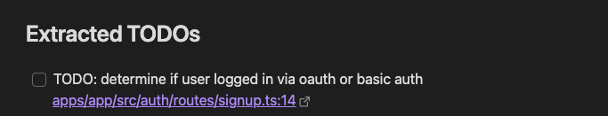

# Obsidian TODO Extractor

Sync your codebase TODO comments with Obsidian.

## Installation

1. Open Obsidian Settings
2. Go to Community Plugins and disable Safe Mode
3. Click Browse community plugins
4. Search for "TODO Extractor" and install it
5. Enable the plugin in the Community Plugins section

## Usage

1. Set up the plugin in the settings (Obsidian Settings > TODO Extractor)
2. Specify your repository path and other settings
3. Use the command palette (Ctrl/Cmd + P) and search for "Extract TODOs"
4. Run the command to extract TODOs from your codebase into an Obsidian note

This plugin uses [simple-git](https://github.com/steveukx/git-js) to scan your local repo, then uses the `git grep` command to find all TODOs in the codebase. It then creates or updates a markdown file in Obsidian with all the TODOs.

## Limitations

The following comment styles are supported:

```ts
// TODO: single line comments
/* TODO: multi-line comments */
{/* TODO: JSX comments */}
# TODO: for Python
```

## Screenshots




## Commands

- Extract TODOs: Extracts all TODOs from your codebase into an Obsidian note

## Features

- [x] uses `git grep` to find TODOs in the codebase. Can define your own patterns.
- [x] Add a link back to the code file and line number (opens via editor prefix)
- [x] Scan local repo for TODOs
- [ ] Scan remote url's for TODOs
  - [ ] add support for public repos
  - [ ] add support for private repos
- [x] Create/Update markdown file in Obsidian with TODOs
- [x] Deduplicate existing TODOs in Obsidian
- [ ] Remove TODOs that are no longer in the codebase.
- [x] Add support for other tags like FIXME, NOTE, etc. (using git grep regex)
- [ ] add support for multiple repositories
- [x] Add support for custom tags
- [x] Add support for custom file paths
- [x] Add support for custom git grep patterns (double escaped regex)
  - (default: `//\\s*TODO:,#\\s*TODO:,{/\\*\\s*TODO:`)
- [ ] Add support for more comment styles
- [x] Add support for custom TODO headings

## Settings

- repoPath: string (path to your local git repository)
- branchName: string (git branch to scan for TODOs)
- todoNote: string (name of the note to store TODOs)
- noteTag: string (optional tag for the TODO note)
- autoPullInterval: number (in minutes, 0 means disabled)
- fileExtensions: string[] (file types to scan for TODOs)
- editorPrefix: string (prefix for editor links, e.g., "vscode://")
- todoHeading: string (heading for the TODO note)
- todoRegex: string (regex pattern to match TODOs)

## Contributing

Contributions are welcome! Please feel free to submit a Pull Request.

## License

[MIT](LICENSE)
